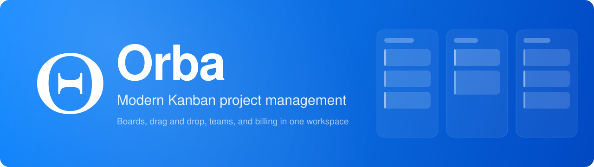

<div align="center">
  
</div>

<div align="center">

# Orba

Modern Kanban project management for teams. Organize work on drag and drop boards, collaborate with members, and manage subscriptions, all in one workspace.

<p>
  
  
  
  
  
  
  
  
  
</p>

</div>

## Overview

Orba is a project management platform built around Kanban boards. It gives teams a clean, accessible interface to plan work, track progress across customizable columns, and reorganize tasks with drag and drop. Authentication, team collaboration, and Stripe billing are built in, so the app is ready to run as a complete product rather than a demo.

## Features

- **Kanban boards**: Customizable columns with create, edit, delete, and drag and drop reordering.
- **Task management**: Titles, descriptions, priorities, due dates, assignees, labels, comments, and attachments.
- **Drag and drop**: Smooth card and column reordering powered by dnd-kit.
- **Authentication**: Email and password plus OAuth (Google, GitHub) through NextAuth.js, with password hashing and email based recovery.
- **Team collaboration**: Email invitations, member and admin roles, and per project permissions.
- **Subscriptions**: Stripe checkout, customer portal, and webhook synchronization for free and premium plans.
- **Project templates**: Predefined templates to start new projects quickly.
- **User profiles**: Personal information and activity statistics.
- **Light and dark themes**: Theme switching with next-themes and an accessible shadcn/ui component layer.
- **Documentation site**: Built in guide, FAQ, and troubleshooting pages.

## Tech Stack

| Area | Technology |
| --- | --- |
| Framework | Next.js 15 (App Router) with React 19 |
| Language | TypeScript |
| Styling | Tailwind CSS 4, shadcn/ui, Radix UI |
| Animation | Framer Motion |
| Database | PostgreSQL with Prisma ORM |
| Authentication | NextAuth.js v4 |
| Payments | Stripe |
| Email | ZeptoMail over SMTP (Nodemailer) |
| Validation | Zod |
| Deployment | Docker and docker compose |

## Getting Started

### Prerequisites

- Node.js 18 or higher
- pnpm
- A PostgreSQL database (local, Docker, or hosted)

### Installation

1. Clone the repository:

   ```bash
   git clone https://github.com/Nathandona/Orba.git
   cd Orba
   ```

2. Install dependencies:

   ```bash
   pnpm install
   ```

3. Create a `.env` file in the project root and set the variables listed in [Environment Variables](#environment-variables).

4. Apply the database schema:

   ```bash
   pnpm db:migrate
   ```

5. Start the development server:

   ```bash
   pnpm dev
   ```

Visit [http://localhost:3000](http://localhost:3000) to open Orba.

### Run with Docker

A `docker-compose.yml` is provided that starts PostgreSQL and the application together:

```bash
docker compose up --build
```

The app is served on port 3000 and PostgreSQL on port 5432. Update the secrets in `docker-compose.yml` before using it beyond local development.

## Environment Variables

| Variable | Description |
| --- | --- |
| `DATABASE_URL` | PostgreSQL connection string used by Prisma |
| `NEXTAUTH_URL` | Base URL of the app, for example `http://localhost:3000` |
| `NEXTAUTH_SECRET` | Secret used to sign NextAuth sessions |
| `GOOGLE_CLIENT_ID` | Google OAuth client ID (optional) |
| `GOOGLE_CLIENT_SECRET` | Google OAuth client secret (optional) |
| `GITHUB_CLIENT_ID` | GitHub OAuth client ID (optional) |
| `GITHUB_CLIENT_SECRET` | GitHub OAuth client secret (optional) |
| `STRIPE_SECRET_KEY` | Stripe secret API key |
| `STRIPE_WEBHOOK_SECRET` | Signing secret for the Stripe webhook endpoint |
| `NEXT_PUBLIC_STRIPE_PUBLISHABLE_KEY` | Stripe publishable key for the client |
| `NEXT_PUBLIC_STRIPE_PRICE_STARTER` | Stripe price ID for the starter plan |
| `NEXT_PUBLIC_STRIPE_PRICE_PRO_MONTHLY` | Stripe price ID for the monthly pro plan |
| `NEXT_PUBLIC_STRIPE_PRICE_PRO_ANNUAL` | Stripe price ID for the annual pro plan |
| `ZEPTOMAIL_USER` | ZeptoMail SMTP user |
| `ZEPTOMAIL_PASS` | ZeptoMail SMTP password |
| `ZEPTOMAIL_FROM_EMAIL` | From address for outgoing email |
| `SALES_EMAIL` | Destination address for contact and sales requests |

OAuth providers and email are optional. Email and password authentication works without them, but password recovery and contact emails require the ZeptoMail variables.

## Scripts

| Script | Description |
| --- | --- |
| `pnpm dev` | Start the development server with Turbopack |
| `pnpm build` | Build the application for production |
| `pnpm start` | Start the production server |
| `pnpm db:migrate` | Create and apply Prisma migrations |
| `pnpm db:push` | Push the schema to the database without migrations |
| `pnpm db:studio` | Open Prisma Studio |
| `pnpm db:reset` | Reset the database and reapply migrations |

## Project Structure

```text
app/          Next.js App Router pages and API routes
components/   UI components, Kanban board, dialogs, and marketing sections
lib/          Auth, Prisma, Stripe, email, and shared utilities
prisma/       Prisma schema
public/       Static assets, logos, and the banner
types/        Shared TypeScript types
middleware.ts Route protection
```

## API Reference

Selected App Router endpoints:

- `POST /api/auth/register`, `POST /api/auth/forgot-password`, `POST /api/auth/reset-password`
- `GET` and `POST /api/projects`, plus `GET`, `PUT`, `DELETE /api/projects/[id]`
- `GET` and `POST /api/projects/[id]/columns`, `GET` and `POST /api/projects/[id]/tasks`
- `GET` and `POST /api/projects/[id]/members`, `POST /api/projects/[id]/leave`
- `PUT` and `DELETE /api/tasks/[id]`, with `/comments` and `/attachments` subroutes
- `POST /api/stripe/checkout`, `POST /api/stripe/portal`, `POST /api/stripe/webhook`

## Contributing

Contributions are welcome. Please read [CONTRIBUTING.md](CONTRIBUTING.md) before opening a pull request.

## License

This project is currently unlicensed. Add a license file before distributing or reusing the code.
